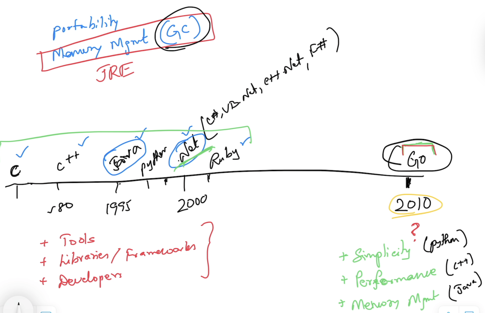
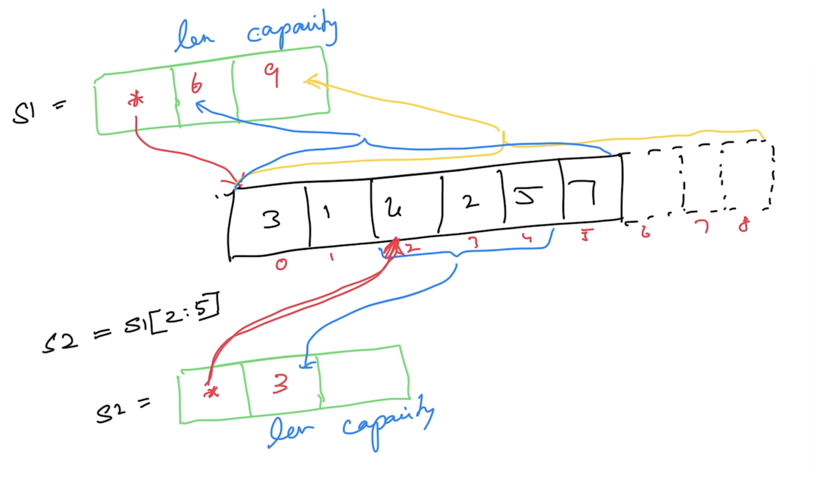

# Go

## Software Requirements
- Go Tools (https://go.dev/dl)
- Visual Studio Code (https://code.visualstudio.com)

## Repository
- https://github.com/tkmagesh/nutanix-go-may-2025

## Why Go?
- Simplicity
    - ONLY 25 keywords
    - Only one way doing things
        - var, :=
        - if else, switch case
        - for
        - function
        - type
        - package
    - No access modifiers (NO private/public/protected keywords)
    - No reference types (everything is a value)
    - No pointer arithmatic supported by the language ( however, support offered through standard library "unsafe" package)
    - No classes (Only structs)
    - No class inheritance (Only struct composition)
    - No exceptions (Only errors & errors are just values)
    - No try..catch..finally
    - No implicit type conversion
- Performance
    - Comparable with C++
    - Close to hardware
        - Build for specific platform
        - Compiler has native support for cross compilation
- Managed Concurrency (**TBD**)
    - Builtin Scheduler to manage concurrent operations
    - "Goroutine" for concurrent operations
        - Cheap (~2KB) vs OS Thread (~2MB)
    - Concurrency support is built in the language
        - "go" keyword
        - "chan" datatype
        - "<-" channel operator
        - "range" construct
        - "select-case" construct
    - Standard library support
        - "sync" package
        - "sync/atomic" package


## Compilation
```shell
go build [filename.go]

# create a binary in a different name
go build -o [binary_name] [filename.go]
```

## Compile & Execute
```shell
go run [filename.go]
```

## Cross Compilation
### list all the go compiler's env variables
```shell
go env
```

### list specific env variables
```shell
go env [var_1] [var_2]
# ex
go env GOPATH GOBIN
```

### Change env variables
```shell
go env -w [var_1]=[value_1] [val_2]=[value_2] ...
```

### Env variables for cross compilation
- GOOS
- GOARCH

### To get the list of supported platforms (for cross compilation)
```shell
go tool dist list
```

### Cross compilation example
```shell
GOOS=windows GOARCH=amd64 go build [filename.go]
```

## Data Types
- string
- bool
- integers
    - int8
    - int16
    - int32
    - int64
    - int
- unsigned integers
    - uint8
    - uint16
    - uint32
    - uint64
    - uint
- floating points
    - float32
    - float64
- complex
    - complex64 ( real[float32] + imaginary[float32] )
    - complex128 ( real[float64] + imaginary[float64] )
- alias
    - byte (alias for unsigned int)
    - rune (alias for unicode code point)

### Zero values

| Data Type | Zero value |
------------ | ------------- |
|int family     | 0 |
|uint family    | 0 |
|float family    | 0 |
|complex family | (0+0i) |
|string         | "" (empty string) |
|bool           | false |
|byte           | 0 |
|interface      | nil |
|pointer        | nil |
|function       | nil |
|struct         | struct instance |


## Standard Library Packages
- Documentation
    - https://pkg.go.dev/std
- Source Code
    - $(go env GOROOT)/src 

## Package Vs Function scope
### Package scope
- CANNOT use ":=" (Only "var" is allowed)
- CAN have unused variables
### Function scope
- CAN use ":="
- CANNOT have unused variables

## Constants
- CAN have unused constants (in both "function" and "package" scope)

## iota
- Constants group with auto-generated values

## Constructs
- if else
- switch case
- for

## Functions
- Can return more than 1 result
- Named results
- Variadic functions
- Anonymous functions
- Higher Order Functions (functions as data)
    - Assign functions as values to variables
    - Pass functions as arguments
    - Return functions as return values
- Deferred functions

## Collection Types
### Array
- Fixed sized typed collection

### Slice
- Varying sized typed collection
- append()
- len()
- cap()
    - overall memory allocated for the slice
- make()
    - used to preallocate the memory when the slice is created


### Map
- Typed collection of key/value pairs
- Has to be initialized with make() 
- delete()

## Error Handling
- An Error is just a value "returned" from a function
- By convention, an error value should implement "error" interface
    - any object with "Error()" method
- Ways to create an error
    - errors.New()
    - fmt.Errorf()
    - Custom type implementing "error" interface

## Panic & Recovery
### Panic
- State of the application where the application execution is unable to proceed further.
- When a "panic" occurs, the application is shutdown after executing all the  functions (deferred) that are already deferred
- Use "panic()" to programmatically raise a panic
    - a panic is typically raised with an error (that led to the panic scenario)

### Recovery
- The "recover()" function can be used to recover from a panic
- The "recover()" function returns the error that resulted in the panic
- Apt to use the "recover()" function in "deferred" functions

## Modules & Packages
### Module
- Any code that has to be versioned and deployed together
- A module is typically a folder with "go.mod" file
- **go.mod** file (manifest file) contains:
    - the name of the module
        - should include the complete repo path
    - the go version targetted
    - references to other dependencies


#### Create a `go.mod` file
```shell
go mod init <module_name>
```
- by convention, the module name should include the repo path (not mandatory)

#### Compile & Execute a module
```shell
go run .
```

#### Compile a module
```shell
go build .
# OR
go build -o [binary-name] .
```

### Package
- internal code organization of a module
- typically folders
- can also be nested
- All the code in a package (across files) are considered to be belonging to the "package"
- Accessibility is determined by the naming convention
    - Public - the entity name must start with **uppercase**
    - Private - the entity name must start with **lowercase**